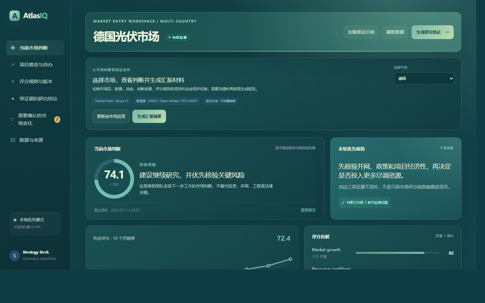

# AtlasIQ

> **运行成本：免费** — 数据源全部为免费公开数据（PVGIS / World Bank / OWID / Open-Meteo / 公开 RSS-GDELT），本地 SQLite 默认运行；Ollama 可选，不依赖付费 API 或云服务。

> **界面预览（德国光伏市场工作台）**
>
> 
>
> 左侧选择国家市场（德国/西班牙/法国/阿联酋/沙特），右侧是八因素影响矩阵、当前市场判断、带证据的研究结论与项目推进待办。

## 多源特征仓与证据闭环（2026-08-18）

AtlasIQ 现在把每个国家的公开观测、新闻摘要和评分快照分开保存：PVGIS 提供太阳能资源与单位装机年发电潜力，World Bank Open Data 提供 GDP 增长、FDI、电力可及性和可再生电力占比；OWID、Open-Meteo 与公开 RSS/GDELT 则分别补充年度能源、短期天气和事件信号。所有来源均免费、无需付费 API 或云服务。

- 八因素影响矩阵：市场增长、电力需求、光照与发电潜力、项目经济性、并网消纳、政策与招标、宏观与融资、供应链与贸易。
- 每一格都会呈现状态（`observed` / `assumption` / `insufficient`）、来源、更新时间、覆盖率、缺失率和影响解释；缺少真实观测时不伪装成实时量化结论。
- 新闻只保存公开标题、RSS/API 摘要与受限短摘录，不做文章全文镜像。规则优先抽取事件类型、影响方向与关联因素；Ollama 仍只承担受控研究表达，不能直接改分。
- 事件在人工确认前只作为研究线索；确认动作有国家隔离与审计记录，仍不会自动改写市场结论。
- Word/PDF 报告使用一次生成的 factor snapshot，输出覆盖率、来源状态与引用的 Evidence IDs，避免页面与报告读取到不同版本的数据。

数据频率并不一致：PVGIS 是地点资源估算；World Bank 与 OWID 多为年度或滞后指标；Open-Meteo 是未来 7 天预测；RSS/GDELT 是事件驱动信号。页面会分别显示更新时点，不能把这些数据误读成同频实时市场价格。

## 企业项目准入与尽调闭环（2026-08-18）

AtlasIQ 不再只回答“某国市场值不值得看”，而是把研究结果转成新能源企业真实的项目开发动作：创建海外项目机会、运行准入评估、处理尽调 blocker、由负责人显式推进阶段，并导出项目准入简报。

- 项目阶段：初筛、尽调中、待评审、已准入、暂缓、淘汰。
- 准入评估复用同一份八因素快照；并网、政策/招标、项目经济性等关键维度缺少结构化支撑时会生成 blocker。
- 尽调任务带有因素、责任人、截止日期、优先级、证据 ID 与完成说明；重复评估不会重复创建开放任务。
- 存在开放 blocker 时，服务端拒绝将项目推进到“待评审”或“已准入”；“已准入”必须填写人工决策说明。
- 已确认的国家证据只会向相应活跃项目创建高优先级复核待办，绝不自动准入、淘汰或改变项目阶段。
- 项目准入简报固定项目字段、准入快照、待办和 Evidence IDs，适合进入周会、项目立项或投资委员会材料的准备流程。

> 面向新能源出海团队的本地优先 AI 市场研究与决策协作平台。

AtlasIQ 以“新能源出海市场进入研究”为场景：首批支持德国、西班牙、法国、阿联酋和沙特，将公开数据、研究证据、透明评分、情景模拟、实时 AI 简报、市场动态和可投递报告放进同一条可追溯的决策链路。

架构与面试讲解图见 [docs/architecture.md](docs/architecture.md)，面试话术见 [docs/interview/atlasiq-interview-guide.md](docs/interview/atlasiq-interview-guide.md)。

## 项目解决的问题

海外市场团队经常面对分散的宏观、能源、天气、政策与新闻资料。普通 BI 只能展示数据，普通聊天机器人又难以证明结论依据。AtlasIQ 的设计原则是：

1. **统计模块负责计算**：透明评分、趋势、情景分析。
2. **AI 负责组织表达**：仅根据后端提供的指标与文档证据流式生成简报。
3. **用户保留决策权**：系统记录“持续观察 / 积极研究 / 暂缓进入”等人工决策，而不自动给出投资建议。

## 当前 MVP 功能

- 五国新能源出海工作台：德国、西班牙、法国、阿联酋、沙特各有独立 Country Profile、坐标、新闻关键词、数据审计状态和已发布 Market Pack；切换国家不会覆盖彼此结果。
- 本地报告交付：用户显式点击后把国家评分、情景、P10/P50/P90、数据新鲜度、证据与新闻信号汇总为 Markdown 单一来源，并在本机生成不可覆盖的 Word/PDF 文件。
- 安全报告投递：未配置 SMTP 时仅返回带附件清单的安全预览；配置后才可由用户点击发送 MIME 附件。新闻轮询不会自动生成或发送报告。
- 情景模拟与不确定性区间：调整补贴、需求、并网风险、资源条件；以固定随机种子输出 P10 / P50 / P90 与“达到积极研究阈值”的比例。
- 单变量敏感性分析：在当前情景下逐项扰动四类假设并按评分影响排序，帮助分析师把尽调资源优先投入最关键的不确定性。
- 实时 SSE 研究问答：可配置本地 Ollama；不可用时使用可引用、可演示的确定性降级回答。
- 证据卡片：AI 回答只展示服务端已提供的证据编号。
- AI 运行审计：本地保存每次研究所用模式、模型、耗时和证据编号，便于复盘降级行为与输出依据。
- 决策复盘队列：人工保存的判断按逾期、今日与未来 7 天自动分组，防止 AI 结论变成一次性聊天记录。
- 信号触发复盘：已由分析师确认的中高优先级市场动态，会通过政策/并网/需求等证据维度关联已有判断；系统只提醒复核，不会自动改写决策。
- 人工复盘记录：对决策卡留下“维持、调整、终止跟踪”的说明和时间，形成可审计的研究—判断—复核闭环。
- 决策就绪度：保存判断前把证据覆盖、公开数据新鲜度和研究运行审计拆成可解释检查项；只提示需要人工补充的复核动作，不会拦截用户或自动改写结论。
- Markdown 决策简报：一键导出已保存的判断、证据编号、证据内容快照、复盘日期与人工复盘记录；即使后续数据更新，也能还原当时的判断依据。
- 模型运行质量：基于本地运行历史计算 P50/P95 延迟、降级率和有证据输出占比；测试数据库与演示数据库隔离，避免测试样本污染指标。
- 数据新鲜度：公开能源与天气数据源展示最近检查时间、最近成功时间和观测范围；审计状态持久化到本地数据库，进程重启后仍可追溯；刷新失败时明确降级而不伪造实时数据。
- 市场动态：后端默认每 5 分钟读取配置化公开 RSS；新增条目和人工确认状态写入本地数据库，网页每 30 秒同步列表，进程重启后仍可复盘。
- 邮件测试：未配置 SMTP 时仅生成安全预览；配置后才会发送测试邮件。

## 技术栈

- **前端**：React、TypeScript、Vite、Tailwind CSS、自定义 SVG 数据图表
- **后端**：FastAPI、Pydantic、httpx、SSE
- **数据与任务边界**：PostgreSQL、Redis、Docker Compose
- **本地 AI（可选）**：Ollama + 任意兼容 `/api/generate` 的本地模型

市场指标仍使用可复现的演示种子与公开数据刷新结构；订阅与投递记录默认写入本地 SQLite，确保没有 PostgreSQL、Redis、Ollama 或 SMTP 时仍可展示完整主流程。Docker Compose 已配置 PostgreSQL 与 Redis：启动容器后，应用会用 PostgreSQL 保存订阅/投递记录，并用 Redis 缓存市场总览；Redis 不可用时自动直算。

## 本地运行

### 一键启动（Windows）

```powershell
.\scripts\start-local.ps1
```

如需启动后打开网页：

```powershell
.\scripts\start-local.ps1 -OpenBrowser
```

如果后端代码已经更新、但 8000 端口仍是旧进程，可显式重启 AtlasIQ API（本地 SQLite 数据不会删除）：

```powershell
.\scripts\start-local.ps1 -RestartApi -OpenBrowser
```

默认情况下，脚本只启动未运行的本地 API / Web 服务；只有显式传入 `-RestartApi` 才会停止 8000 端口上的 API 进程。脚本不会启动 Docker。

### 1. 启动 API

```powershell
python -m venv .venv
.\.venv\Scripts\python.exe -m pip install -r backend\requirements.txt
Set-Location backend
$env:PYTHONPATH='.'
..\.venv\Scripts\python.exe -m uvicorn app.main:app --reload --port 8000
```

### 2. 启动 Web

在另一个终端：

```powershell
Set-Location frontend
npm install
npm run dev
```

打开 `http://localhost:5173`。

### 3. 可选：使用本地 Ollama

复制 `.env.example` 中的变量到系统环境后再启动 API：

```powershell
$env:OLLAMA_BASE_URL='http://localhost:11434'
$env:OLLAMA_MODEL='qwen2.5:3b'
```

未配置时，研究问答会自动走带引用的本地确定性演示回复，便于零成本运行和测试。

### 3.1 可选：自动刷新公开新闻

API 默认每 300 秒刷新一次公开 RSS。可在启动 API 前调整或关闭：

```powershell
$env:NEWS_POLL_INTERVAL_SECONDS='300' # 设为 0 可关闭
```

刷新产生的新动态仍需分析师确认；SMTP 未配置时只创建安全邮件预览。

### 3.2 可选：生成和发送本地报告

在网页中选择国家，点击“生成 Word / PDF 摘要”，系统会将文件保存在本机 `generated-reports/`（可用 `ATLASIQ_REPORT_DIR` 修改）。点击“邮件预览”永远不会发送邮件；只有在配置完整 SMTP 变量后点击“确认发送”才会发送所选报告附件。

### 4. 可选：Docker Compose

```powershell
docker compose up --build
```

Web 位于 `http://localhost:5173`，API 位于 `http://localhost:8000`。

Docker Desktop 未启动时，`docker compose` 无法拉起 PostgreSQL 和 Redis；这不会影响本地 SQLite 模式下的开发与演示。

### 5. 面试演示样本

网页右上角的“加载面试示例”会在本地 SQLite 中幂等写入一张标记为示例的决策卡、一条人工复盘记录，并确认演示用并网信号。它不访问外部服务、不会重复插入，也不会修改真实市场评分；用于快速展示决策、信号和复盘闭环。

## 验证

```powershell
.\scripts\verify.ps1

# 或只运行后端测试
.\scripts\verify.ps1 -BackendOnly

# 等价的分步命令
Set-Location backend
$env:PYTHONPATH='.'
..\.venv\Scripts\python.exe -m pytest -q

Set-Location ..\frontend
npm run build
```

项目不默认启用远程 CI，以避免私有仓库的托管运行时配额产生意外消耗；`scripts/verify.ps1` 在本机执行与展示所需的后端回归和前端生产构建检查。

## 3 分钟面试 Demo

1. 在“出海研究工作台”切换西班牙、法国、阿联酋或沙特，说明 Country Profile 与 Market Pack 分层：改数据源或新闻关键词不会覆盖评分版本。
2. 将“补贴支持变化”调到 -20%，运行模拟，说明单变量敏感性排序、P10/P50/P90 与不确定性边界；解释“模型显示影响最大”不等于“自动作出结论”。
3. 在 AI 研究区提问“主要风险是什么？”，展示 SSE 流式输出、证据引用、本次运行的模型/降级模式与耗时，以及运行历史的 P50/P95 质量摘要。
4. 查看“决策就绪度”，说明系统将证据、数据新鲜度、运行审计转成透明检查，不以是否调用大模型作为质量标准。
5. 保存一张决策卡并设置复盘日期，展示逾期、今日、未来 7 天的复盘队列，说明 AI 输出必须由人按新证据回看。
6. 在市场动态中确认一条中高优先级信号，展示它如何因共享证据维度而提醒复盘对应决策卡，但不会自动改变结论。
7. 打开一张决策卡的“记录复盘”，保存“维持 / 调整 / 终止跟踪”及人工说明，展示系统留存审计记录而非替人决策。
8. 点击“导出简报”，下载 Markdown 决策文档，说明系统可把研究过程转成团队可复用的交付物。
9. 点击“生成 Word / PDF 摘要”，展示本机生成的双格式报告；先点“邮件预览”说明不会联网发送，再解释真实 SMTP 仅在用户显式配置并点击“确认发送”后启用。

## 面试讲解材料

完整的 60 秒项目介绍、简历表述、3 分钟 Demo 台词、AI 必要性说明和技术追问参考见 [AtlasIQ 面试讲解稿](docs/interview/atlasiq-interview-guide.md)。

## 重要边界

- 所有数据均为公开数据接入结构和演示种子；当前种子新闻不代表真实实时市场事实。
- AtlasIQ 不提供投资建议，不自动执行市场进入决策。
- 不使用付费 API、付费云服务或无边界新闻爬虫。
- Word/PDF 由 `python-docx` 与 `reportlab` 在本机生成；报告默认不上传云端。
- AI 无法直接执行 SQL；后端只向 AI 传入受控分析输出和已验证证据。
