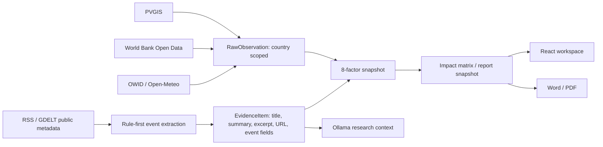
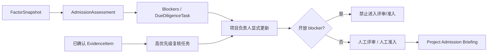
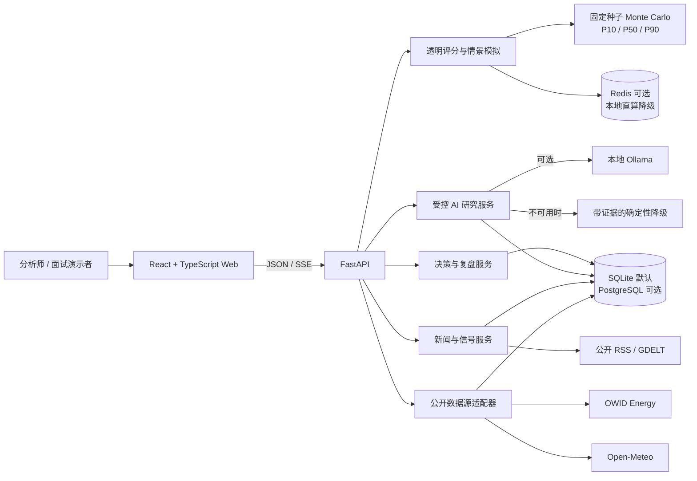
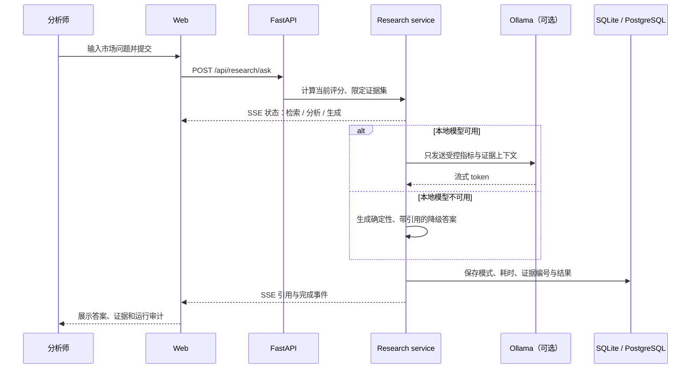

# AtlasIQ 架构与工程说明

## 多源特征仓与可审计证据流

关键边界：原始观测、文本证据与评分快照均按 `profile_id` 隔离并持久化。评分规则只使用结构化数值观测；未确认的文本事件不会产生隐式分数调整。AI 可以对已入库证据做受控研究表达，但不能写入分数、不能直连数据库、不能替代人工确认。

刷新失败时保留上一次成功的原始观测和 `last_success_at`，并把来源标为 `degraded`；系统不以 0 填充缺失值。PVGIS、World Bank、OWID、Open-Meteo、公开 RSS/GDELT 都是无密钥或免费数据源，默认 SQLite 本地运行不产生云费用。

## 项目准入与尽调协同层

项目机会、准入评估和尽调任务是独立持久化对象。每次评估保存其使用的 `FactorSnapshot` ID；任务记录关联因素和证据 ID。阶段推进只接受人工 API 调用：有 blocker 时拒绝评审/准入，已准入必须保留人工决策说明。已确认文本证据只能创建复核任务，不能自动改变项目状态或评分。

AtlasIQ 是一个面向新能源出海研究团队的本地优先市场研究与决策协作应用。首个案例为德国光伏市场进入研究。

## 一张图理解系统

## 请求链路

## 数据与统计能力如何落地

| 能力 | AtlasIQ 中的实现 | 面试可讲的价值 |
| --- | --- | --- |
| 加权评分 | 四类市场指标按明确权重计算机会分数 | 规则可解释、可复算，不把模型当黑箱 |
| 情景分析 | 补贴、需求、并网风险、资源条件可独立调整 | 将业务假设转为可讨论的变量 |
| 蒙特卡洛 | 固定随机种子生成 P10/P50/P90 与达标比例 | 表达不确定性区间，而不是伪装成精确预测 |
| 单变量敏感性 | OAT 扰动并按最大影响排序 | 帮助团队把尽调资源投向最关键假设 |
| 决策就绪度 | 证据覆盖、数据新鲜度、运行审计三项检查 | 把“是否继续研究”转成透明的人机协同门槛 |

## 可靠性与边界

- **AI 不直接访问数据库**：服务端先筛选指标与证据，再将受控上下文交给本地模型。
- **模型不可用也可演示**：Ollama 不可用时进入确定性、带证据编号的降级链路，并记录降级模式。
- **不自动改写人工判断**：中高优先级新闻只触发复盘提醒；最终判断、调整或终止跟踪由人记录。
- **证据可回放**：新决策卡会保留证据内容快照；后续源数据变化不会抹去当时依据。
- **状态可跨重启追溯**：新闻、研究运行、决策、复盘与数据源审计都写入数据库。
- **零成本优先**：默认 SQLite、公开数据、本地 Ollama 和安全邮件预览；PostgreSQL、Redis、SMTP 仅在用户主动配置时启用。

## 容易被追问的工程选择

### 为什么没有强制依赖 Ollama？

AI 的职责是将已验证的指标和证据组织成可读研究简报，而不是生成事实。可审计的降级结果比“模型不可用就整条链路失败”更符合真实业务系统的可用性要求。

### 为什么不让新闻自动改变市场评分？

单条新闻不等于经过验证的市场事实。AtlasIQ 将新闻作为触发人工复核的信号，避免不可靠外部文本直接污染评分与决策。

### 为什么决策卡要保存证据快照？

只保存证据 ID 会在数据源更新后失去历史语境。快照使决策可以被复盘、审计和复现，且通过独立表实现，不破坏已有卡片数据。

### SQLite 与 PostgreSQL / Redis 如何切换？

本地演示默认使用 SQLite，降低求职作品的启动成本；Docker Compose 提供 PostgreSQL 与 Redis。数据库连接和缓存均通过环境变量切换，Redis 不可用时市场总览会退回本地计算。
